--- 
title: "Resonance Tube" 
author: VA
numbersections: true 
---

`mdpdf labmanual-resonancetube.md -t la`

# Theory

## Standing waves in tubes: basics

Here's a (very) brief summary of the theory:

When sound waves travel through a finite tube, the waves get reflected at the
ends of the tube. The incident waves interfere with the reflected waves, and
the resulting wave pattern can be found by adding the displacements of the
individual waves (principle of superposition).  

At certain frequencies, the incident waves and reflected waves interfere
constructively, producing a wave pattern with distinct **nodes** (points that
don't move) and **antinodes** (points of maximum oscillation). These are called
**standing waves** (so called because the wave doesn't appear to be
moving/propagating in any particular direction---it just oscillates). The
frequencies that produce this standing wave pattern are called **resonant
frequencies.** 

The tube’s boundary conditions (i.e. whether the tube is open or closed at the
ends) will determine the kind of standing wave that can be produced. If the
tube has a closed end, that end must necessarily be a node (since particles are
fixed in place). If a tube has an open end, that end must be an antinode (since
particles are free to oscillate). 

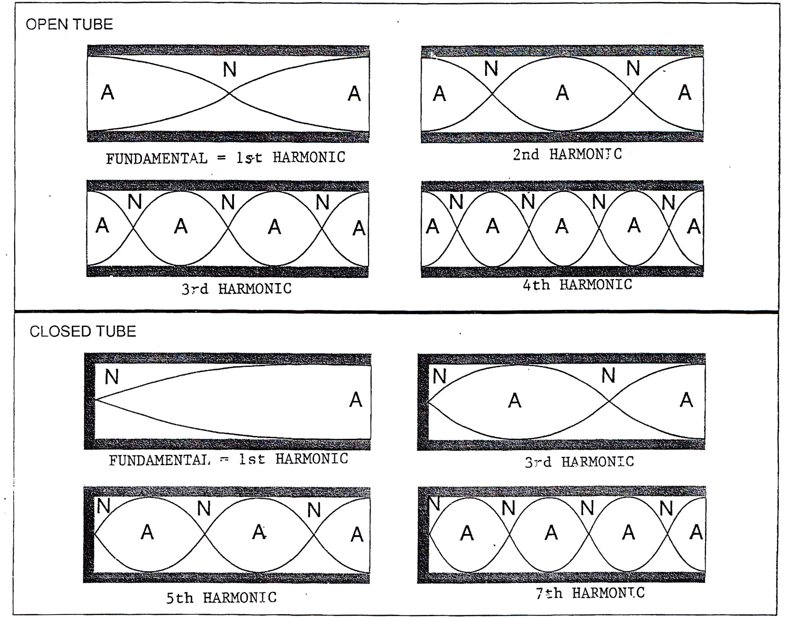{
width=80% }

The length of the tube also affects the the kind of standing waves that can be
produced. A standing wave can only occur if a periodic "element" of the wave
fits perfectly inside the length of the tube. In a fully closed tube, there
must be a node at each end in order for a standing wave to be observed. In a
tube with one end open, there must be a node at the closed end and an antinode
at the other.  In a fully open tube, there must be antinodes at both ends. 

The simplest frequency that satisfies these requirements is called the
fundamental harmonic. Each successive "higher-order" harmonic will have one
extra set of nodes and antinodes over the previous one. 

## Further reading, references, videos

Some videos:

- [Khan Academy, "Standing Waves"](https://www.youtube.com/watch?v=gT0IqL1dyyk)
- [Khan Academy, "Standing Waves in Open Tubes"](https://www.youtube.com/watch?v=BhQUW9s-R8M)
- [Khan Academy, "Standing Waves in Closed Tubes"](https://www.youtube.com/watch?v=1S4DtuMY88I)

Some reading material:

- [Openstax Physics, Standing Waves and
  Resonance](https://openstax.org/books/university-physics-volume-1/pages/16-6-standing-waves-and-resonance)
- [Young & Freedman. University Physics, Ch 15, "Mechanical
  Waves".](https://drive.google.com/drive/folders/1s5rGFl1JyXJO0UvyvqE3euCgO9LsVNT0) 
- [Feynman Lectures, Ch47, "Sound. The wave equation"](https://www.feynmanlectures.caltech.edu/I_47.html)
- [Feynman Lectures, Ch 49, "Modes"](https://www.feynmanlectures.caltech.edu/I_49.html)

# Experiment Setup

## Overview

In this lab you will examine standing sound waves in a tube with different
boundary conditions and lengths. One end of the tube is always closed, and has
a speaker attached to it. The other end of the tube can be closed with a piston
which you can move back and forth to change the length of the tube. You can
also remove the piston to create a tube with one end open. Below is a
horizontal view of the apparatus:

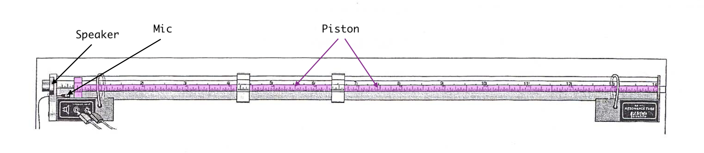{ width=100% }

And below is a diagram of the individual parts:

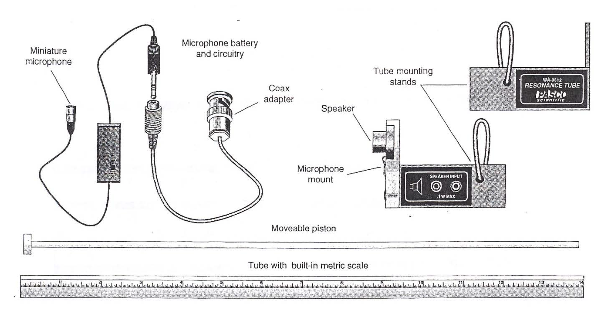{ width=100% }

In the first experiment, the speaker is used to to send sinusoidal sound waves
through the tube.  A small microphone in the tube detects the sound waves. At
the resonant frequencies, the sound waves will be enhanced. 

In the second experiment, a pulse of sound is sent down the tube and the
reflected pulse will be examined. The nature of the reflected pulse depends on
whether the end of the tube is open or closed. You can use the observed and
reflected pulses to estimate the speed of sound.

## Hardware setup

1. At the speaker end of the tube, notice that there is a small
   microphone-shaped circular hole. **Move the microphone into the tube and
place it at the 10 cm mark.** You may need to loosen the thumbscrew to allow
the microphone into the tube. 

2. Notice that the lead from the microphone goes to a preamplifier which has an
   on-off switch. **Turn this switch on.** 
   
3. Make sure the rest of the setup is wired correctly. You should find that the
   output of the preamplifier connects to a phone plug, which then connects to
a coaxial adapter, which then connects to a BNC adapter, and which reaches its
logical conclusion at the banana plugs of a voltage sensor: 

4. Connect the voltage sensor to Channel A of the Pasco 850 interface. 

5. Connect the two leads of the speaker are connected to Output 1 of the '850.  

## Capstone setup

1. Open Capstone. 

2. In the *Hardware Setup* pane, click on Channel A and select "Voltage
   Sensor". 

3. Click on the gear icon in the bottom right to open the voltage sensor
   properties. 

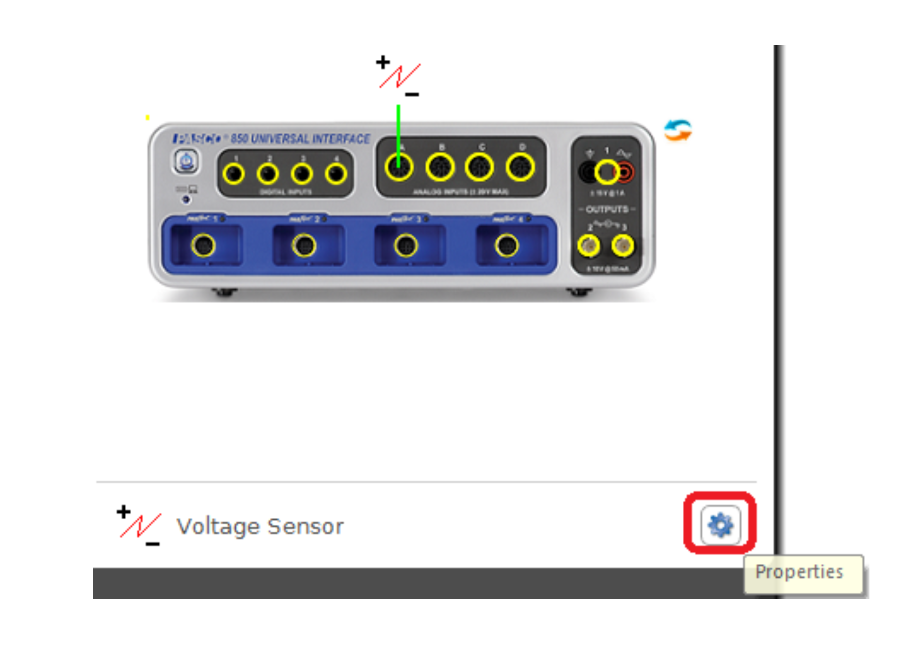{ width=60% }

4. In the voltage sensor properties window, change the sensitivity (gain) from
   the default of 1x to 100x. 

{ width=55% }

5. Back in the Hardware Setup pane, click on Output 1 of the '850 and select
   "Output Voltage - Current Sensor"

6. In the *Displays* pane (on the RHS of the display), click and drag the
   "Scope" icon into the center of the screen. 

7. For the $y$-axis, under "Select Measurements", choose "Output Voltage Ch
   01". 

8. At the top of the scope window, click the icon for "Add new $y$-axis", to
   add the second channel. For this second $y$-axis (which should appear on the
   RHS), choose "Voltage, Ch A". 

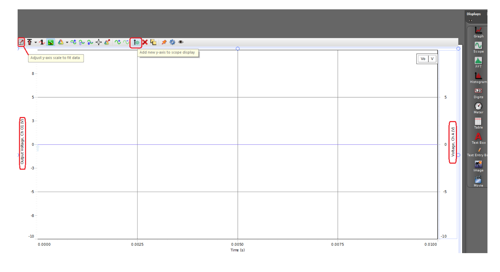{ width=100% }

The Capstone oscillscope should now be configured. When you hit "Monitor" you
should see two traces appear on the scope. The voltage of the signal generator
(the signal being emitted from the speaker) should be on the first channel, and
the voltage from the voltage sensor (the signal that's being detected by the
mic) should be on the second channel. 

## Features of the Capstone scope

The Capstone oscilloscope is designed to display the waveform of the sound
waves. The $x$-axis is time, and the $y$-axis is voltage output. 

The image below indicates some (useful) features of the Capstone oscilloscope:

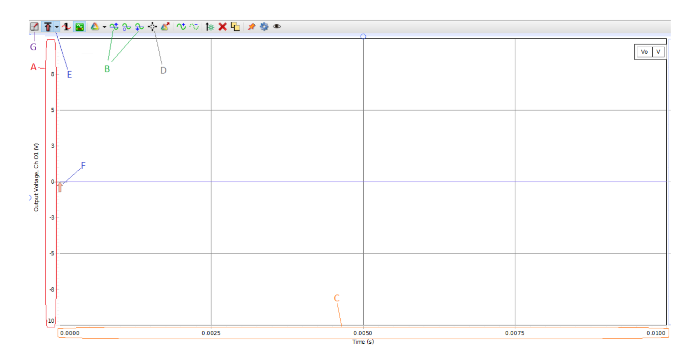{ width=100% }

- **A.** click and drag the $y$-axis in the vertical direction to change the
  scale 
- **B.** moves the scope trace up or down on the screen
- **C.** click and drag the $x$-axis in the horizontal direction to stretch or
  compress the trace
- **D.** selects the "smart tool" function
- **E, F.** the trigger. This is used to make the scope trace appear static on
  the screen. In particular, if you notice the trace is "moving" across the
  screen, hit the trigger button. Move the arrow (marked **F**) up or down to
  freeze the trace, and/or adjust the trigger level (the value at which the
  sweep will start the signal). 
- **G.** adjust the $y$-axis to fit the data. This is useful to see the full
  amplitude of multiple waveforms. 

# Experiment 1: Measuring Wavelength 

## Overview

In this experiment you will attempt to measure the wavelength of the standing
sound wave in the tube. You will do this by changing the position of the piston
(i.e. altering the length of the tube) and noting the positions that correspond
to resonant frequencies. 

## Setup procedures

1. Go to the *Signal Generator* pane (on the LHS) and click on "850 Output 1".
   Under the "Waveform" dropdown, select "sine wave". Set the frequency to 650
   Hz and the amplitude to 1.1 V. And click the button marked "Auto". 

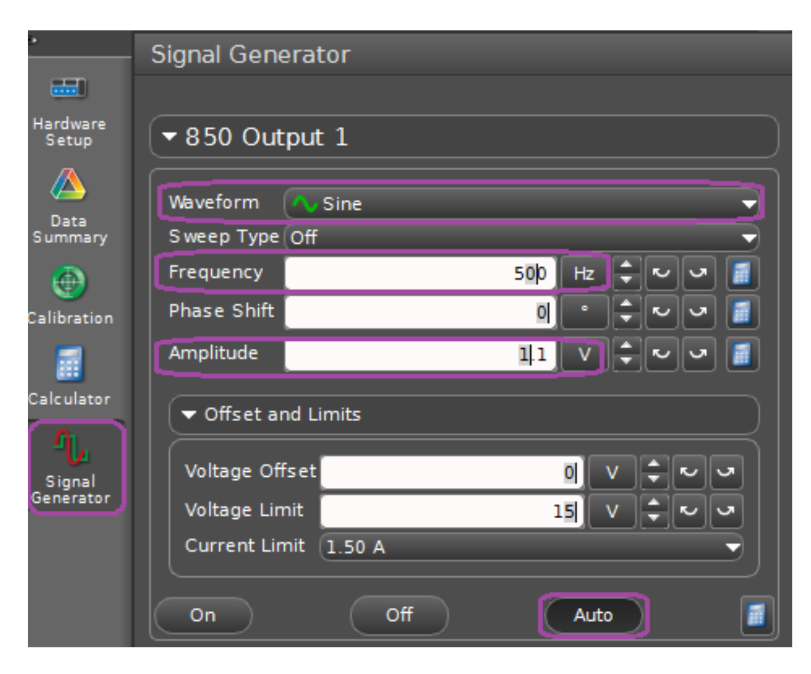{ width=50% }

2. At the bottom of the screen, select "Fast Monitor Mode". 

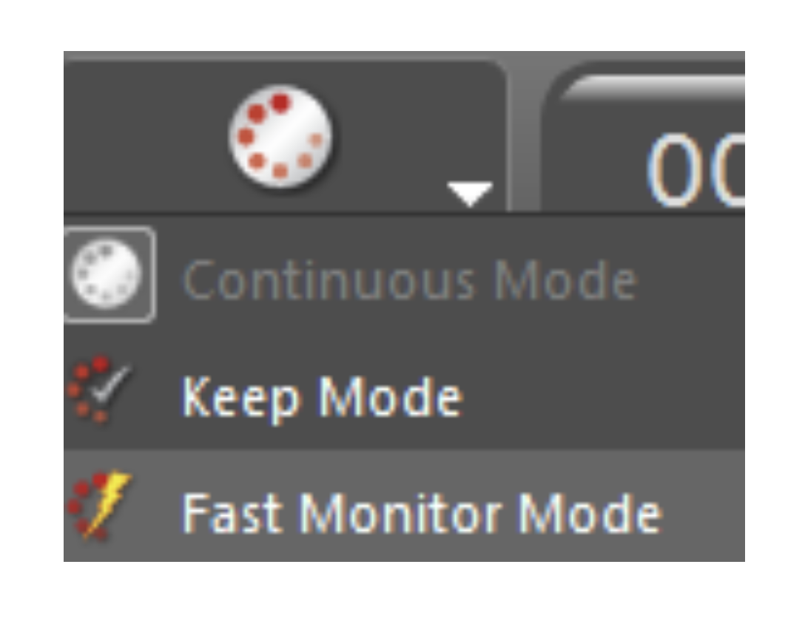{ width=25% }

3. Adjust the trigger arrow and move it slightly above 0.2 V. Then "click on
   adjust the y axis scale".

## Experiment procedures

1. First, move the piston into the tube, until it's positioned near the mic. 

2. Then gradually pull the piston outwards, (i.e. increasing the effective
   length of the tube). 
   
3. As you do, watch how the waveform changes on Capstone.  Find the positions
   of the piston that give the maximum signal from the microphone. Make note of
these positions.  These are the positions that correspond to resonant
frequencies.  

5. Note that successive piston positions are half a wavelength apart. Determine
   the wavelength $\lambda$ using your data. 

6. Compare the experimental value of $\lambda$ to the theoretical one, which is
   given by $\lambda f = v$. 

7. Repeat the above procedures for signal frequencies of 900 Hz and 1300 Hz. Do
   the same analysis. How does the wavelength change when you increase or
   decrease the frequency? Explain your results. 

# Experiment 2: Pulsed Waves

## Overview

In this experiment, short pulses will be sent down the tube from the speaker.
This is achieved by driving the speaker with a relatively low frequency of 8
Hz. The will cause the speaker cone to move very quickly one way and then stop,
which sends a short compression or rarefraction pulse down the tube.  This
pulse will reflect from the end of the tube and propagates back towards the
speaker.  It will then bounce off the speaker end of the tube, and continue to
go back and forth along the tube until it's damped. The period of the square
wave is chosen to be long enough so that the pulse is completely dissipated
before the speaker cone moves the other way in response to the square wave, and
sends the next pulse down the tube. The pulses alternate between compressions
and rarefractions. 

## Procedures

1. Configure the signal generator for an 8 Hz positive square wave with an
   amplitude of 3 V. 

2. Loosen the thumbscrew holding the microphone, and place the microphone in
   the tube at the 10 cm mark. 

3. Move the piston out to 80 cm. Use the speaker stand to support the tube. 

4. Make sure Capstone is set to "Fast monitor mode". 

5. Next, you'll want to adjust the scope to obtain the initial pulse and the
   reflected pulse. There are two possible ways you can do this:

   **Method 1:**

   1. Make sure you've clicked on the trigger button and adjusted the trigger
	  arrow to be slightly positive (just as in experiment 1). 

   2. Click "Monitor".

   3. Click on "adjust $y$-axis scale to fit data" (top left). You should see
	  an image similar the one below. The region highlighted in green is the
	  initial pulse and the region highlighted in blue is the reflected pulse.
	  
	  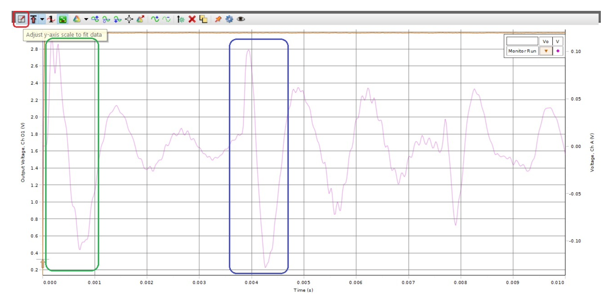{ width=80% }

   **Method 2:**

   1. Adjust the $x$-axis (by dragging it horizontally) so the scope pattern
	  looks like the one in the image below. There should be about 0.05 s/div. 

	  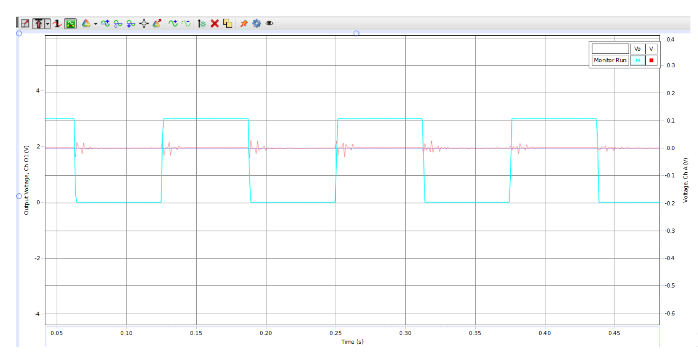{ width=80% }

   2. On the scope click on the $x$-axis variable (time) and adjust the time
	  division to approximately 1 ms/div, so that the trace looks like the
	  image below:

	  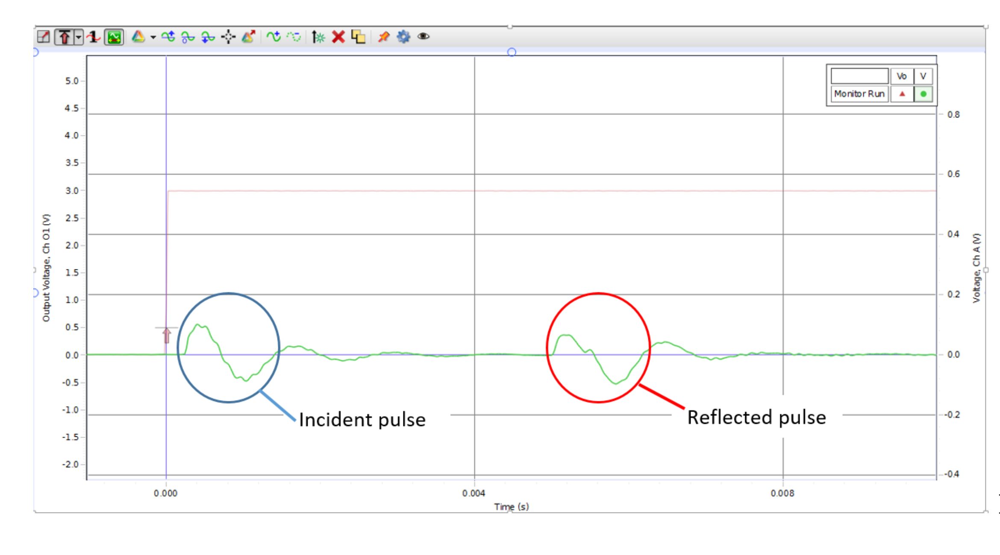{ width=80% }

## Determining the speed of sound

By using the displacement between the microphone and piston, and determining
the time between the initial pulse and the reflected pulse, you can determine
the speed of sound. Use the *Delta Tool* (Capstone) to find the time between
pulses:

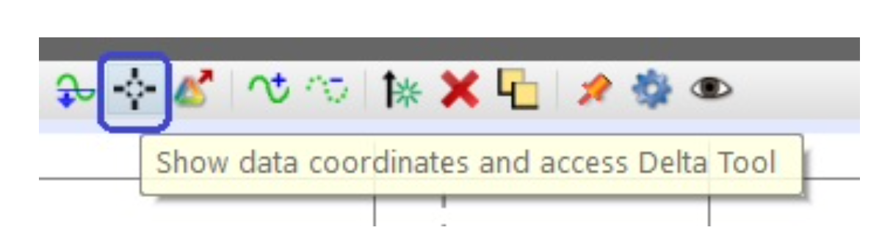{ width=40% } 

You may want to increase the number of decimal places to obtain a precise value
for the time between pulses. In the *Tools* column, click on "Data Summary", go
to "clock", and click on the gear icon. A properties window will show up:

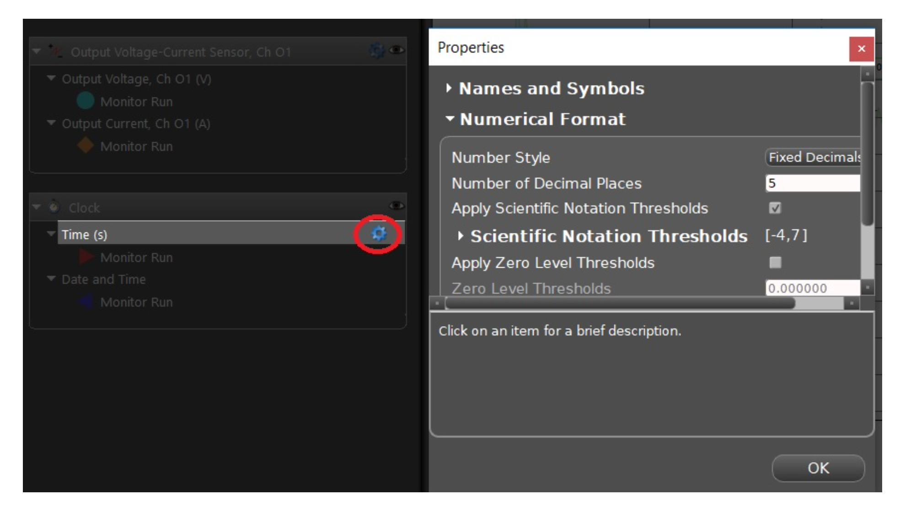{ width=60% }

With the scope running, slowly move the piston towards the speaker. What is
occurring to the signal on the scope? Explain. 

## Changing the boundary conditions

In a resonance tube, the nature of the reflected pulse depends on the boundary
conditions. If the end of the tube is open, it becomes a pressure node, which
causes the pressure of the reflected pulse to invert, and cancel out the
pressure of the initial pulse. 

If the end of the tube is closed (as in experiment 1), the boundary is a
displacement node and a pressure antinode, so the pressure of the reflected
pulse is not inverted.  

Remove the piston from the tube and support the end of the tube with the stand.
The tube should now have one end open. Hit "Monitor" and observe the reflected
pulse. 

Now close the end of the tube with the rubber stopper and note how the
reflected pulse changes. Discuss what you see. 

